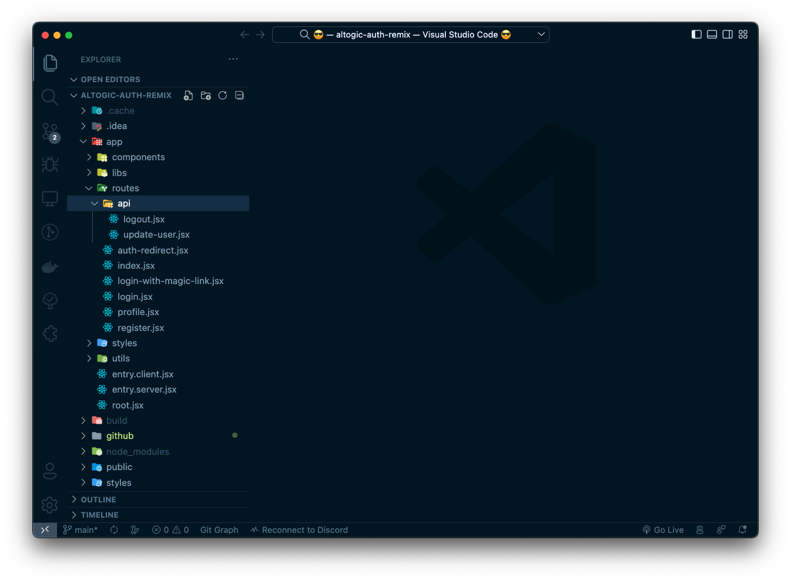

# How to Authenticate Email and Password Using Remix & Altogic


## Introduction
[Altogic](https://www.altogic.com) is a Backend as a Service (BaaS) platform and provides a variety of services in modern web and mobile development. Most modern applications using React or other libraries/frameworks require knowing the identity of a user. And this necessity allows an app to securely save user data and session in the cloud and provide more personalized functionalities and views to users.

Altogic has an authentication service that integrates and implements well in JAMstack apps. It has a ready-to-use [Javascript client library](https://www.npmjs.com/package/altogic), and it supports many authentication providers such as email/password, phone number, magic link, and OAuth providers like Google, Facebook, Twitter, Github, etc.,

In this tutorial, we will implement email/password authentication with Remix and take a look at how as a Remix developer, we build applications and integrate with Altogic Authentication.

After completion of this tutorial, you will learn the following:

- How to create sample screens to display forms like login and signup.
- How to create a home screen and authorize only logged-in users.
- How to create an authentication flow by conditionally rendering between these pages whether a user is logged in.
- How to authenticate users using the magic link
- How to update user profile info and upload a profile picture
- How to manage active sessions of a user
- And we will integrate Altogic authentication with the email/password method.

If you are new to Vue applications, this tutorial is definitely for you to understand the basics and even advanced concepts.


## Prerequisites
To complete this tutorial, make sure you have installed the following tools and utilities on your local development environment.
- [VsCode](https://code.visualstudio.com/download)
- [NodeJS](https://nodejs.org/en/download/)
- [Remix App](https://remix.run/docs/en/v1/tutorials/blog#quickstart)
- You also need an Altogic Account. If you do not have one, you can create an account by [signin up for Altogic](https://designer.altogic.com/).

## How email-based sign-up works in Altogic
By default, when you create an app in Altogic, email-based authentication is enabled. In addition, during email-based authentication, the email address of the user is also verified. Below you can find the flow of email and password-based sign-up process.


If email verification is disabled, then after step 2, Altogic immediately returns a new session to the user, meaning that steps after step #2 in the above flow are not executed. You can easily configure email-based authentication settings from the **App Settings > Authentication** in Altogic Designer. One critical parameter you need to specify is the Redirect URL, you can also customize this parameter from **App Settings > Authentication**. Finally, you can also customize the email message template from the A**pp Settings > Authentication > Messaget Templates**.


## Creating an Altogic App
We will use Altogic as a backend service platform, so let’s visit [Altogic Designer](https://designer.altogic.com/) and create an account.


After creating an account, you will see the workspace where you can access your apps.

Click + New app and follow the instructions;

1. In the App name field, enter a name for the app.
2. Enter your subdomain.
3. Choose the deployment location.
4. And select your free execution environment pricing plan.


Then click Next and select Basic Authentication template. This template is creates a default user model for your app which is required by [Altogic Client Library](https://github.com/altogic/altogic-js) to store user data and manage authentication.

Then click Next and select Basic Authentication template. This template is based on session authentication and highly recommended to secure your apps.


Then click Next to confirm and create an app.

Awesome! We have created our application; now click/tap on the **newly created app to launch the Designer.** In order to access the app and use the Altogic client library, we should get `envUrl` and `clientKey` of this app. You can use any one of the API base URLs specified for your app environment as your envUrl.

Click the **Home** icon at the left sidebar to copy the `envUrl` and `clientKey`.


Once the user created successfully, our Vue.js app will route the user to the Verification page, and a verification email will be sent to the user’s email address. When the user clicks the link in the mail, the user will navigate to the redirect page to grant authentication rights. After successfully creating a session on the Redirect page, users will be redirected to the Home page.

## Create a Remix project
Make sure you have an up-to-date version of Node.js installed, then run the following command in your command line
```bash
npx create-remix@latest
```

I showed you which options to choose in the image I will give you below. You can choose the same options as I did.

Open altogic-auth-remix folder in Visual Studio Code:
```bash
code altogic-auth-remix
```
## Integrating with Altogic
Our backend and frontend is now ready and running on the server. ✨

Now, we can install the Altogic client library to our Remix app to connect our frontend with the backend.
```bash
# using npm
npm install altogic
# OR is using yarn
yarn add altogic
```
Let’s create a `libs/` folder inside your `app/` directory to add **altogic.js** file.

Open altogic.js and paste below code block to export the altogic client instance.

```js
// /app/libs/altogic.js
import { createClient } from 'altogic';

const ENV_URL = ''; // replace with your envUrl
const CLIENT_KEY = ''; // replace with your clientKey
const API_KEY = ''; // replace with your apiKey

const altogic = createClient(ENV_URL, CLIENT_KEY, {
	apiKey: API_KEY,
	signInRedirect: '/login',
});

export default altogic;
```
> Replace ENV_URL, CLIENT_KEY and API_KEY which is shown in the **Home** view of [Altogic Designer](https://designer.altogic.com/).


## Create Routes
Remix has built-in file system routing. It means that we can create a page by creating a file in the `app/routes` directory.
Let's create some pages and directory in **pages/** folder as below:
* api/logout.jsx
* api/update-user.jsx
* index.jsx
* login.jsx
* register.jsx
* profile.jsx
* login-with-magic-link.jsx
* auth-redirect.jsx



### Replacing app/routes/index.jsx with the following code:
In this page, we will show Login, Login With Magic Link and Register buttons.
```jsx
import { Link } from '@remix-run/react';
import { json } from '@remix-run/node';
import { requireNoAuth } from '~/utils/auth.server';

export async function loader({ request }) {
	await requireNoAuth(request);
	return json({});
}

export default function Index() {
	return (
		<div className="flex items-center justify-center gap-4 h-screen">
			<Link to="/login-with-magic-link" className="border px-4 py-2 font-medium text-xl">
				Login With Magic Link
			</Link>
			<Link to="/login" className="border px-4 py-2 font-medium text-xl">
				Login
			</Link>
			<Link to="/register" className="border px-4 py-2 font-medium text-xl">
				Register
			</Link>
		</div>
	);
}
```

### Replacing app/routes/login.jsx with the following code:
In this page, we will show a form to log in with email and password. 

We will use **remix's action** call our backend api. We will save session and user infos to state and storage if the api return success. Then user will be redirected to profile page.
```jsx
import { Form, Link, useActionData, useTransition } from '@remix-run/react';
import { login, createUserSession, requireNoAuth } from '~/utils/auth.server';
import { json } from '@remix-run/node';
import altogic from '~/libs/altogic';

export async function loader({ request }) {
	await requireNoAuth(request);
	return json({});
}

export async function action({ request }) {
	const formData = await request.formData();
	const { email, password } = Object.fromEntries(formData);
	const { session, errors } = await login({ email, password });

	if (errors) {
		return json({ errors });
	}

	altogic.auth.setSession(session);
	return createUserSession(session.token, '/profile');
}
export default function Login() {
	const transition = useTransition();
	const actionData = useActionData();
	const busy = transition.state === 'submitting';

	return (
		<section className="flex flex-col items-center justify-center h-96 gap-4">
			<Form method="post" className="flex flex-col gap-2 w-full md:w-96">
				<h1 className="self-start text-3xl font-bold">Login to your account</h1>
				{actionData?.errors && (
					<div className="bg-red-600 text-white text-[13px] p-2">
						{actionData.errors?.items?.map((error, index) => (
							<p key={index}>{error.message}</p>
						))}
					</div>
				)}

				<input name="email" type="email" placeholder="Type your email" required />
				<input name="password" type="password" placeholder="Type your password" required />
				<div className="flex justify-between gap-4">
					<Link className="text-indigo-600" to="/register">
						Don't have an account? Register now
					</Link>
					<button
						disabled={!!busy}
						type="submit"
						className="border py-2 px-3 border-gray-500 hover:bg-gray-500 hover:text-white transition shrink-0"
					>
						Login
					</button>
				</div>
			</Form>
		</section>
	);
}
```

### Replacing pages/login-with-magic-link.vue with the following code:
In this page, we will show a form to **log in with Magic Link** with only email. We will use Altogic's **altogic.auth.sendMagicLinkEmail()** function to log in.

````jsx
import { Link, useActionData, useFetcher } from '@remix-run/react';
import altogic from '~/libs/altogic';
import { json } from '@remix-run/node';
import { useRef, useEffect } from 'react';

export async function action({ request }) {
    const formData = await request.formData();
    const email = formData.get('email');
    const { errors } = await altogic.auth.sendMagicLinkEmail(email);
    return json({ errors });
}

export default function LoginWithMagicLink() {
    const actionData = useActionData();
    const fetcher = useFetcher();
    const formRef = useRef(null);
    const isDone = !actionData?.errors && fetcher.type === 'done';

    useEffect(() => {
        if (isDone) formRef.current?.reset();
    }, [isDone]);

    return (
        <section className="flex flex-col items-center justify-center h-96 gap-4">
            <fetcher.Form ref={formRef} method="post" className="flex flex-col gap-2 w-full md:w-96">
                <h1 className="self-start text-3xl font-bold">Login with magic link</h1>

                {isDone && (
                    <div className="bg-green-600 text-white text-[13px] p-2">
                        We have sent you a magic link. Please check your email.
                    </div>
                )}

                {actionData?.errors && (
                    <div className="bg-red-600 text-white text-[13px] p-2">
                        {actionData.errors?.items?.map((error, index) => (
                            <p key={index}>{error.message}</p>
                        ))}
                    </div>
                )}

                <input name="email" type="email" placeholder="Type your email" required />
                <div className="flex justify-between gap-4 items-start">
                    <Link to="/register" className="text-indigo-600">
                        Don't have an account? Register now
                    </Link>
                    <button
                        type="submit"
                        className="border py-2 px-3 border-gray-500 hover:bg-gray-500 hover:text-white transition shrink-0"
                    >
                        Send magic link
                    </button>
                </div>
            </fetcher.Form>
        </section>
    );
}
````

### Replacing app/routes/register.jsx with the following code:
In this page, we will show a form to sign up with email and password. We will use **remix's action** call our backend api.

We will save session and user infos to state and storage if the api return session. Then user will be redirected to profile page.

If signUpWithEmail does not return session, it means user need to confirm email, so we will show the success message.

```jsx
import { Form, Link, useActionData, useTransition } from '@remix-run/react';
import { json } from '@remix-run/node';
import altogic from '~/libs/altogic';
import { register, createUserSession, requireNoAuth } from '~/utils/auth.server';
import { useEffect, useRef } from 'react';

export async function loader({ request }) {
	await requireNoAuth(request);
	return json({});
}

export async function action({ request }) {
	const formData = await request.formData();
	const { email, password, name } = Object.fromEntries(formData);
	const { user, session, errors } = await register({ email, password, name });

	if (errors) {
		return json({ errors });
	}

	if (!session) {
		return json({ needToVerify: true });
	}

	altogic.auth.setSession(session);
	return createUserSession(session.token, '/profile');
}
export default function Login() {
	const transition = useTransition();
	const actionData = useActionData();
	const busy = transition.state === 'submitting';
	const formRef = useRef(null);

	useEffect(() => {
		if (actionData?.needToVerify) {
			formRef.current?.reset();
			document.activeElement.blur();
		}
	}, [actionData]);

	return (
		<section className="flex flex-col items-center justify-center h-96 gap-4">
			<Form ref={formRef} method="post" className="flex flex-col gap-2 w-full md:w-96">
				<h1 className="self-start text-3xl font-bold">Login to your account</h1>
				{actionData?.needToVerify && (
					<div className="bg-green-500 text-white p-2">
						Your account has been created. Please check your email to verify your account.
					</div>
				)}
				{actionData?.errors && (
					<div className="bg-red-600 text-white text-[13px] p-2">
						{actionData.errors?.items?.map((error, index) => (
							<p key={index}>{error.message}</p>
						))}
					</div>
				)}
				<input name="name" autoComplete="given-name" type="text" placeholder="Type your name" required />
				<input name="email" autoComplete="email" type="email" placeholder="Type your email" required />
				<input
					name="password"
					type="password"
					autoComplete="new-password"
					placeholder="Type your password"
					required
				/>
				<div className="flex justify-between gap-4">
					<Link className="text-indigo-600" to="/login">
						Already have an account? Login now
					</Link>
					<button
						disabled={!!busy}
						type="submit"
						className="border py-2 px-3 border-gray-500 hover:bg-gray-500 hover:text-white transition shrink-0"
					>
						Create account
					</button>
				</div>
			</Form>
		</section>
	);
}
```

### Replacing app/routes/auth-redirect.jsx with the following code:

We use this page for verify the user's email address and Login With Magic Link Authentication.

```jsx
import { json } from '@remix-run/node';
import { useLoaderData } from '@remix-run/react';
import altogic from '~/libs/altogic';
import { createUserSession } from '~/utils/auth.server';

export async function loader({ request }) {
	const url = new URL(request.url);
	const accessToken = url.searchParams.get('access_token');

	const { session, errors } = await altogic.auth.getAuthGrant(accessToken);
	if (errors) return json({ errors });
	await createUserSession(session.token, '/profile');
}

export default function AuthRedirect() {
	const { errors } = useLoaderData();
	return (
		<section className="h-screen flex flex-col gap-4 justify-center items-center">
			{errors && (
				<div className="text-center">
					{errors.items?.map((error, index) => (
						<p className="text-red-500 text-3xl" key={index}>
							{error.message}
						</p>
					))}
				</div>
			)}
		</section>
	);
}
```

## Conclusion
Congratulations!✨

You had completed the most critical part of the Authentication flow, which includes private routes, sign-up, sign-in, and sign-out operations.

If you have any questions about Altogic or want to share what you have built, please post a message in our [community forum](https://community.altogic.com/home) or [discord channel](https://discord.gg/zDTnDPBxRz).

